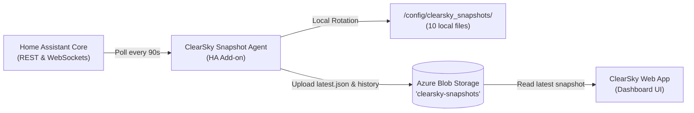

# ClearSky Snapshot Web Dashboard (PoC)

This web application displays Home Assistant diagnostic snapshots synchronized to **Azure Blob Storage** by the ClearSky Snapshot Agent.

---

## 🏛 Architecture Overview



The add-on implements a **Dual Sync Strategy**:
1. **`latest.json`**: Constantly updated/overwritten with the freshest snapshot, allowing the web app to query a static path without searching for blob keys.
2. **`snapshots/snapshot_YYYYMMDD_HHMMSS.json`**: An immutable historical archive of each diagnostic poll for time-series inspection and auditing.

---

## ⚡ Quick Start: Running the Web App

### Option 1: Run with Companion Server (Recommended)

The companion server securely connects to Azure using your Connection String without exposing keys in the browser:

```powershell
# In PowerShell or Bash:
cd web_app

# Optional: Set Azure Connection String (if not set, the app will run with sample demo data)
$env:AZURE_STORAGE_CONNECTION_STRING="DefaultEndpointsProtocol=https;AccountName=...;AccountKey=...;EndpointSuffix=core.windows.net"
$env:AZURE_CONTAINER_NAME="clearsky-snapshots"

# Start server:
python server.py
```
Open **[http://localhost:8080](http://localhost:8080)** in your browser.

### Option 2: Standalone Static App / Azure Static Web Apps

`index.html` is a standalone Single Page Application (SPA). You can open it directly in a web browser or deploy it to **Azure Static Web Apps**:
1. Open `web_app/index.html` in your browser.
2. Click the ⚙️ **Settings** button in the header.
3. Switch connection mode to **Direct Azure Blob** and paste a Read-Only SAS URL for `latest.json`:
   ```
   https://<your_account>.blob.core.windows.net/clearsky-snapshots/latest.json?<sas_token>
   ```

---

## ☁️ Azure Storage Configuration Guide

### 1. Create Container
In the [Azure Portal](https://portal.azure.com/):
1. Navigate to your **Storage Account** -> **Containers**.
2. Click **+ Container**, name it `clearsky-snapshots` (or your preferred name), and set Public access level to **Private** (recommended).

### 2. Copy the Connection String for Home Assistant
1. In your Storage Account, go to **Security + networking** -> **Access keys**.
2. Click **Show keys** and copy the **Connection string** for `key1`.

### 3. Configure the Home Assistant Add-on
1. In Home Assistant, open **Settings** -> **Add-ons** -> **ClearSky Snapshot Agent**.
2. Open the **Configuration** tab.
3. Paste the connection string into `azure_storage_connection_string`:
   ```yaml
   poll_interval: 90
   azure_upload_enabled: true
   azure_storage_connection_string: "DefaultEndpointsProtocol=https;AccountName=...;AccountKey=...;EndpointSuffix=core.windows.net"
   azure_container_name: "clearsky-snapshots"
   ```
4. Click **Save** and restart the add-on.
5. In the add-on's **Ingress Web UI**, check the **Azure Sync** status badge at the top to confirm successful uploads!

### 4. Optional: Enable CORS (Only needed if fetching directly from browser)
If using client-side direct fetch via SAS token:
1. In the Azure Storage Account, go to **Resource Management** -> **Resource sharing (CORS)**.
2. Select **Blob service** and add a rule:
   - **Allowed origins**: `*` (or your web app domain)
   - **Allowed methods**: `GET, HEAD, OPTIONS`
   - **Allowed headers**: `*`
   - **Exposed headers**: `*`
   - **Max age**: `3600`

---

## 🔍 Features Included in Dashboard

- **Real-Time Diagnostics**: Live indicator showing snapshot generation timestamp and relative age.
- **Warranty Status Management**: Visual status badges for **Active** (with expiration countdown), **Monitored**, and **Expired** equipment.
- **Entity State Inspection**: Real-time entities, states, actions, temperatures, battery levels, power usage, and timestamps.
- **Filtering & Search**: Instant filter by area (Living Room, Kitchen, Utility Room, etc.), warranty state, or text search across IDs and names.
- **Snapshot History**: Load and inspect any historical snapshot stored in the Azure container.
- **Raw JSON Inspector**: 1-click formatted JSON preview with clipboard copy and download options.
- **Offline & Demo Mode**: Built-in mock data for offline demonstrations and testing before Azure credentials are configured.

